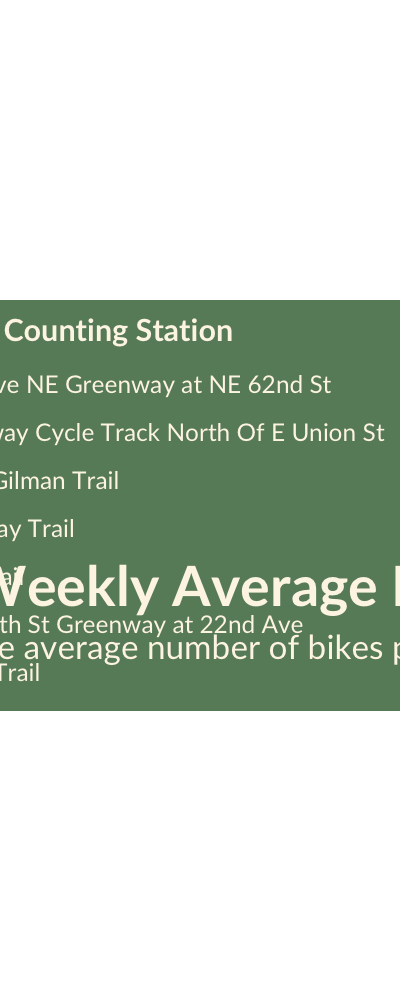

SeattleBikeTraffic
================
Dash Wieland
4/1/2019

## Weekly bike traffic in Seattle

This week’s \#TidyTuesday dataset is bike traffic in Seattle.
Interestingly, this isn’t geographic data-though we could add that by
finding the coordinates of the counting stations-so instead I thought it
might be interesting to capture the seasonality of bike traffic at
different counting stations.

Start by loading the required packages and downloading the data from
GitHub.

``` r
library(dplyr)
library(lubridate)
library(ggplot2)
library(RColorBrewer)
```

``` r
bike_traffic <- readr::read_csv("https://raw.githubusercontent.com/rfordatascience/tidytuesday/master/data/2019/2019-04-02/bike_traffic.csv", col_types = 'cccdd') 
```

## Prepping data for plotting

### Formatting dates with lubridate

The first thing to do is get our dates in a workable format. Per the
readme file for this dataset, the dates are in M/D/Y H/M/S format, so
we’ll use the mdy\_hms() function from the lubridate package to get an
actual date column.

``` r
bike_traffic$lubri_date = mdy_hms(bike_traffic$date)
```

### New variables with mutate()

Now that we have a date, let’s give ourselves some options for plotting.
The lubridate package has handy “floor” functions that round a date to
the specied unit (e.g., month, day, or year). We’ll create floored
month, week, and year columns, as well as a log of the bike count since
there are some extreme outliers. Note: we won’t use all of these in the
resulting plot, but we could if we wanted\!

``` r
bike_taffic_dated <- bike_traffic %>%
  mutate(floor_month_year = month(lubri_date, label = TRUE),
         floor_week_year = week(lubri_date),
         floor_day_year = yday(lubri_date), 
         log_bike_count = log(bike_count))
```

### Grouping and summarising

Now let’s group by year and crossing before summarizing our mean bike
count. We’ll get back a new column from the mutate function labeled
“mean\_bike\_count.” This is the mean bike count for each crossing
across all years.

``` r
bike_taffic_grouped <- bike_taffic_dated %>%
  group_by(floor_week_year, crossing) %>%
  summarise(mean_bike_count = mean(bike_count, na.rm = TRUE))
```

## Ready to plot

I won’t explain the inner workings of this code at the moment, but rest
assured that most of it is styling. The meat of the plot is charting
each station’s average bike count in a line chart (grouped by color and
counting station) and then wrapping that line chart into a circle using
coord\_polor().

The other item of note is that the annotations for the time of year are
added with the geom\_vline() and geom\_text() arguements at the end.
Those can be finicky to control, so customize at your own risk\!

``` r
g <- ggplot(bike_taffic_grouped, aes(x = floor_week_year, y = mean_bike_count)) + 
  geom_line(aes(color = crossing, group = crossing), size = 1) +
  geom_point(aes(color = crossing)) + 
  scale_color_brewer(palette="Set3") +
  coord_polar() + 
  theme(plot.subtitle = element_text(family = "Lato", 
                                     colour = "oldlace",
                                     size = 12,
                                     vjust = -3),
    plot.caption = element_text(family = "Lato", 
                                size = 8, 
                                colour = "oldlace",
                                hjust = 1.65), 
    axis.ticks = element_line(colour = "aliceblue", 
                              size = 1,
                              linetype = "dashed"),
    panel.grid.major = element_line(colour = "darkolivegreen3", 
                                    size = 0.4,
                                    linetype = "dotted"), 
    panel.grid.minor = element_line(linetype = "blank"), 
    axis.title = element_text(family = "Lato", 
                              face = "bold",
                              size = 12,
                              colour = "oldlace"), 
    axis.text = element_text(family = "Lato Medium",
                             size = 12, 
                             face = "bold", 
                             colour = "oldlace",
                             hjust = 1, 
                             vjust = 0.75), 
    axis.text.x = element_text(family = "Lato Medium", 
                               colour = "oldlace"), 
    axis.text.y = element_text(family = "Lato Medium"), 
    plot.title = element_text(family = "Lato",
                              size = 20,
                              face = "bold",
                              colour = "oldlace", 
                              hjust = -.01, 
                              vjust = -2), 
    legend.text = element_text(family = "Lato", 
                               colour = "oldlace"), 
    legend.title = element_text(face = "bold",
                                family = "Lato",
                                colour = "oldlace"), 
    panel.background = element_rect(fill = "darkseagreen4"), 
    plot.background = element_rect(fill = "darkseagreen4"),
    legend.key = element_blank(),
    legend.background = element_rect(fill = "darkseagreen4"),
    plot.margin=grid::unit(c(0,0,0,2), "mm")) +
  labs(title = "Weekly Average Bike Traffic in Seattle", 
       x = "Week of Year",
       y = "Average Bike Count", 
       colour = "Crossing / Counting Station", 
       subtitle = "The average number of bikes passing each counting station, aggregated by week of the year",
       caption = "Made by @DashWieland for #TidyTuesday") + 
  geom_vline(xintercept=1, colour="oldlace") +
  geom_text(aes(x=1,
                label="January",
                y=20),
            colour="oldlace",
            angle=90,
            hjust = -2.2,
            vjust = -.5) + 
  geom_vline(xintercept=18, colour="oldlace") +
  geom_text(aes(x=18,
                label="Late April / Early May",
                y=20),
            colour="oldlace",
            angle=-27,
            hjust = -0.6,
            vjust = -.4) +   
  geom_vline(xintercept=34, colour="oldlace") + 
  geom_text(aes(x=34,
                label="Late August",
                y=20), 
            colour="oldlace",
            angle= 43,
            hjust = 2.15,
            vjust = -1)
```

Now save our new plot to a .png for sharing.

``` r
ggsave("avg_weekly_bike_traffic.png", width = 25, height = 20, units = "cm")
```

Finally - let’s see the result\!

``` r
plot(g)
```

<!-- -->
